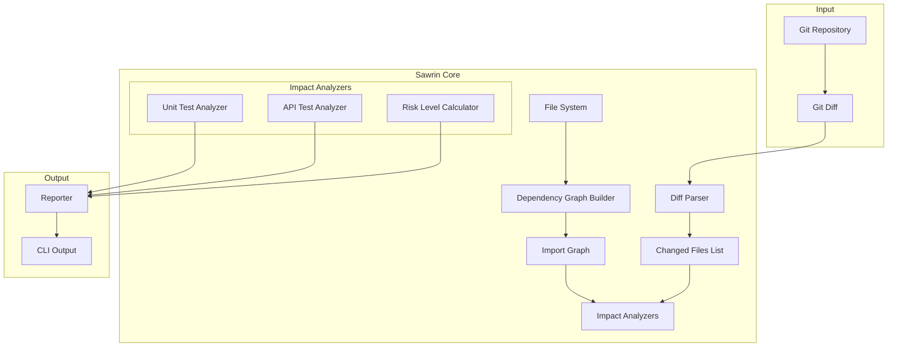

# Sawrin Architecture

## Overview

Sawrin is a deterministic, heuristic-based static analysis tool that analyzes git diffs and determines which tests and APIs are impacted by code changes.

## Architecture Diagram



## Module Responsibilities

| Module                 | Input                     | Output                   | Purpose                              |
| ---------------------- | ------------------------- | ------------------------ | ------------------------------------ |
| **Diff Parser**        | Git diff string           | `ChangedFile[]`          | Parse diff into structured data      |
| **Dependency Graph**   | Project root              | Import/export map        | Build bidirectional dependency graph |
| **Unit Test Analyzer** | Changed files, graph      | Impacted tests + reasons | Detect affected unit tests           |
| **API Test Analyzer**  | Changed files, Bruno path | Impacted Bruno files     | Detect affected API tests            |
| **Risk Calculator**    | All results               | LOW/MEDIUM/HIGH          | Calculate overall risk level         |
| **Reporter**           | Analysis results          | Formatted output         | Display CLI results                  |

## Project Structure

```
sawrin/
├── src/
│   ├── index.ts              # CLI entry point
│   ├── cli/
│   │   └── commands.ts       # CLI argument parsing
│   ├── core/
│   │   ├── diff-parser.ts    # Parse git diff output
│   │   ├── dependency-graph.ts  # Build import/export graph
│   │   └── git.ts            # Git operations wrapper
│   ├── analyzers/
│   │   ├── base-analyzer.ts  # Base analyzer interface
│   │   ├── unit-test-analyzer.ts
│   │   ├── api-test-analyzer.ts
│   │   └── risk-calculator.ts
│   ├── heuristics/
│   │   ├── naming-conventions.ts
│   │   ├── folder-conventions.ts
│   │   └── route-patterns.ts
│   ├── reporter/
│   │   └── cli-reporter.ts   # Format output for CLI
│   └── types/
│       └── index.ts          # TypeScript interfaces
└── tests/
    ├── diff-parser.test.ts
    ├── dependency-graph.test.ts
    ├── unit-test-analyzer.test.ts
    ├── api-test-analyzer.test.ts
    └── risk-calculator.test.ts
```
